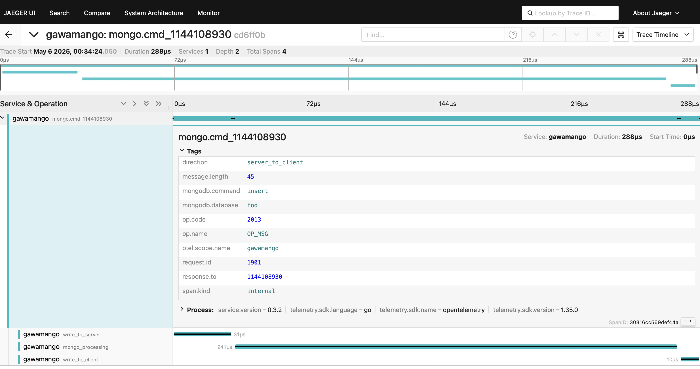

# Gawamango - MongoDB Proxy


> [!WARNING]
> This project is not for production use.

Gawamango is a minimal MongoDB proxy that transparently forwards MongoDB wire
protocol messages between clients and servers while providing observability
through OpenTelemetry.

## Features

- Transparent message forwarding
- Support for MongoDB wire protocol
- OpenTelemetry tracing integration
- MongoDB command parsing and monitoring
- Slow query detection (>500ms)
- Half-closed TCP connection handling
- Transparent to MongoDB clients

## Installation

```bash
go install github.com/ringsaturn/gawamango/cmd/gawamango@latest
```

## Usage

```bash
# Basic usage
gawamango -listen localhost:27018 -target localhost:27017

# Help
gawamango -help
```

For example, start a server:

```bash
OTEL_EXPORTER_OTLP_ENDPOINT=http://localhost:4318 gawamango
```

Then use MongoDB client to connect to gawamango.

```py
from pymongo import MongoClient

client = MongoClient("mongodb://localhost:27018/")

client.foo.bar.insert_one({"name": "John"})
```

You can view the traces in Jaeger like this:



### Command Line Arguments

- `-listen`: Address to listen on (default: localhost:27018)
- `-target`: Target MongoDB address (default: localhost:27017)
- `-silent`: Silent mode, disables command logging
- `-production`: Production mode for logger configuration

### Environment Variables

- `OTEL_EXPORTER_TYPE`: OpenTelemetry exporter type to use:
  - `stdout`: Prints trace data directly to console (useful for debugging)
  - `otlp`: Uses OTLP exporter to send trace data to an OpenTelemetry collector
    (default)

Example of using the stdout exporter for local debugging:

```bash
OTEL_EXPORTER_TYPE=stdout gawamango
```

When using OTLP exporter, you can configure the endpoint using the standard
OpenTelemetry environment variables:

```bash
OTEL_EXPORTER_OTLP_ENDPOINT=http://localhost:4318 gawamango
```

## How It Works

Gawamango acts as a proxy between MongoDB clients and servers:

1. It accepts client connections and establishes connections to the target
   MongoDB server
2. For each connection, it creates two goroutines to handle bidirectional
   traffic
3. All MongoDB wire protocol messages are parsed to extract command information
4. OpenTelemetry spans are created for each MongoDB operation:
   - `mongo.cmd_X` as the root span for each command
   - `write_to_server` for client-to-server communication
   - `mongo_processing` for server processing time
   - `write_to_client` for server-to-client communication

The proxy currently supports OP_MSG operation code and provides detailed tracing
for MongoDB commands.

### Slow Query Detection

Gawamango automatically detects slow queries (taking more than 500ms) and:

- Marks them in traces with `mongodb.slow_query=true` attribute
- Logs them with command name, database, and execution time
- Includes query arguments in the trace for debugging

## Development

### Building from Source

```bash
git clone https://github.com/ringsaturn/gawamango.git
cd gawamango
make build
```

### Running Tests

```bash
make test
```

## License

MIT License
